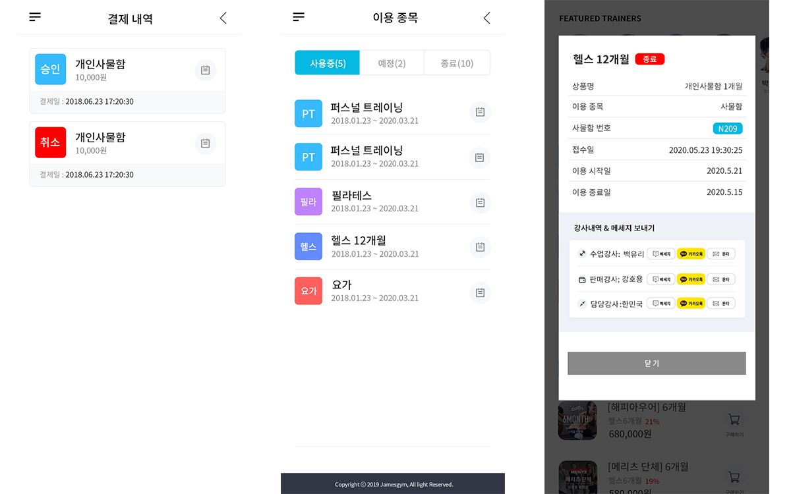
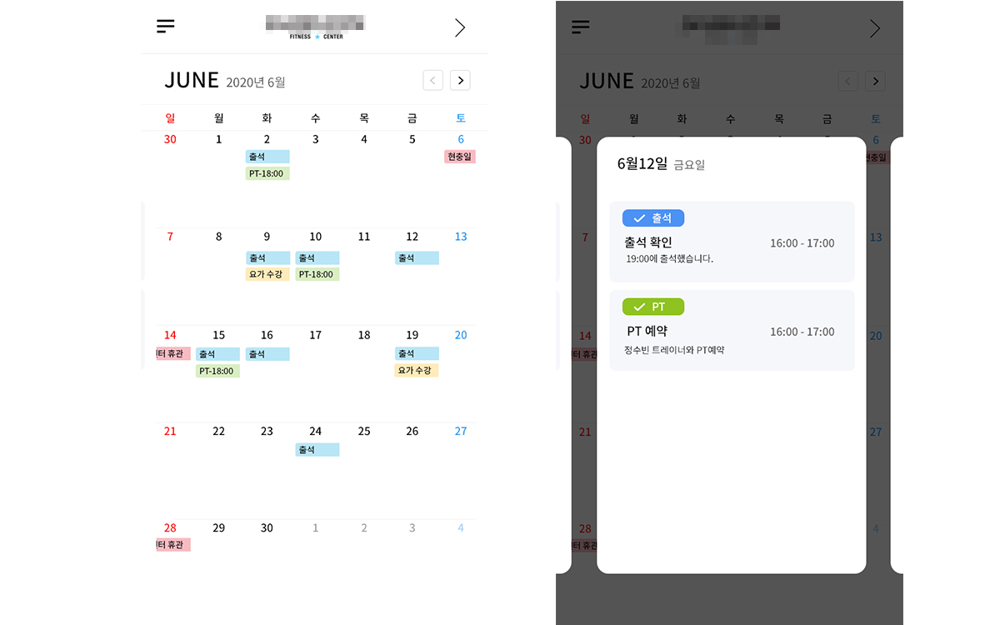
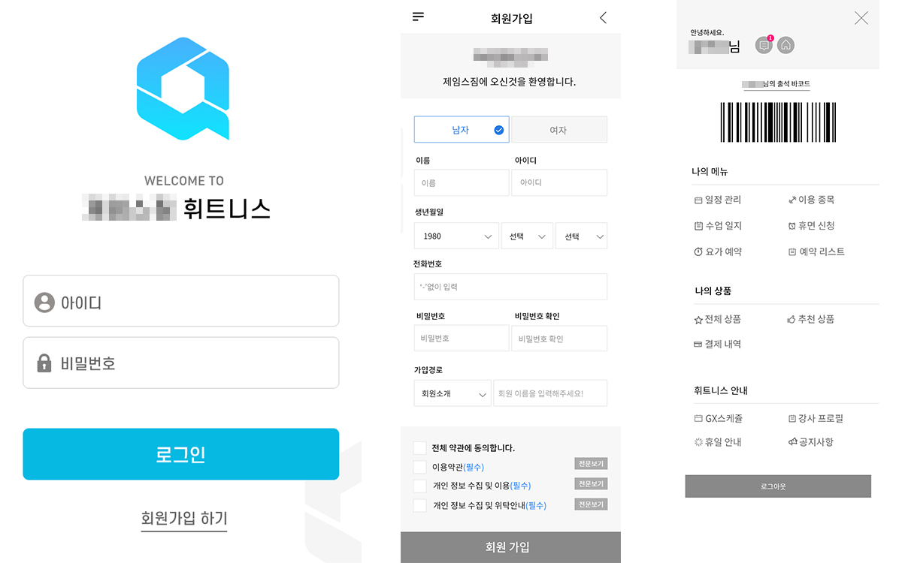
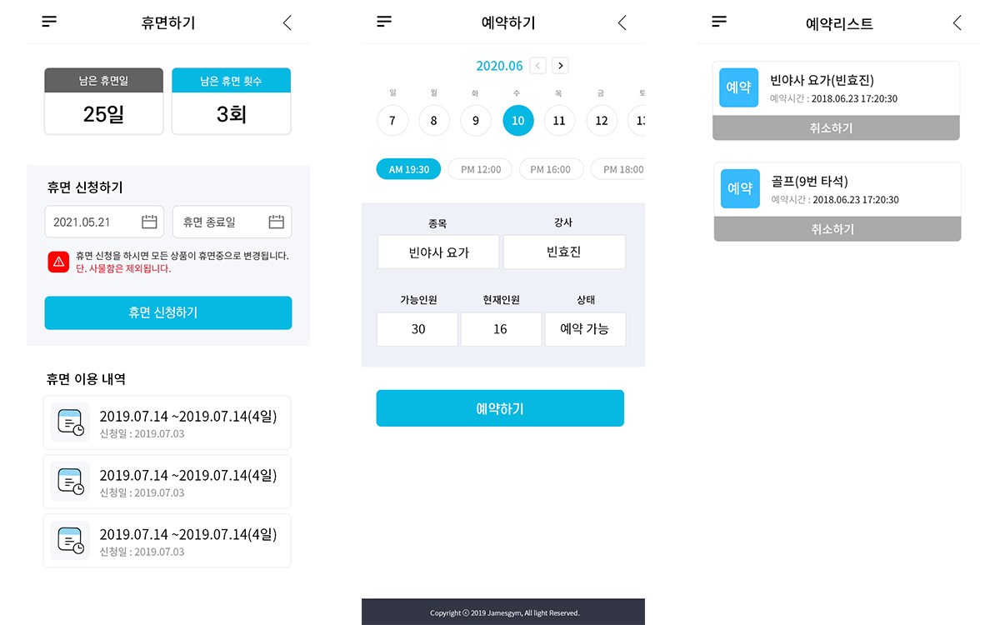
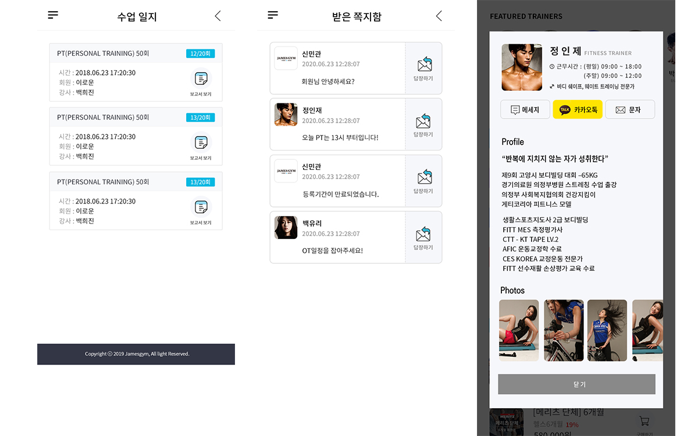
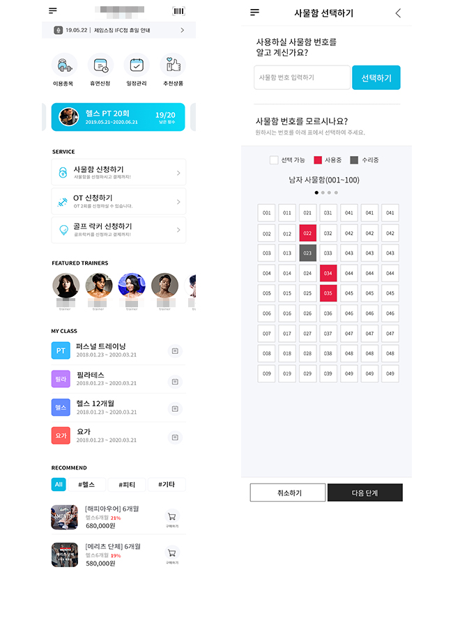
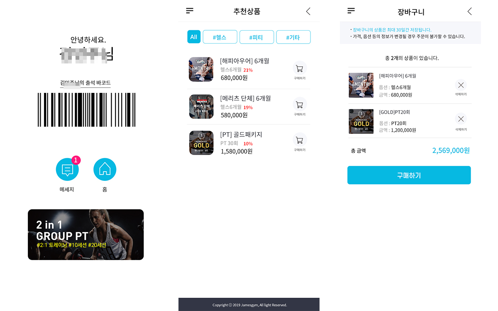

# 센터에서 제공하는 편린하고 간편한 휘트니스어플

### 주요 기능

> 회원 사용
>> 1. 바코드를 활용하여 출석체크
>> 2. 상품리스트 
>> 3. 추천상품 리스트
>> 4. 상품 결제내역 확인
>> 5. 장바구니
>> 6. 사용하고 있는 종목 확인
>> 7. PT또는 OT를 진행했으면 수업일지 확인
>> 8. 자신의 스케줄 
>> 9. 휴면신청
>> 10. GX스케줄
>> 11. 쪽지 확인
>> 12. 강사프로필 확인

> 트레이너 사용
>> 1. 나의 매출 확인
>> 2. 이번달 총 판매 매출
>> 3. PT 판매 매출
>> 4. 이용권 매출
>> 5. 수업 매출
>> 6. 수당 집계표
>> 7. 내정보(프로필)관리
>> 8. 나의 수업(PT)회원 리스트
>> 9. 나의 OT회원 리스트]
>> 10. 회원별 메모
>> 11. 회원 설문관리
>> 12. 전회원 실시간 출석
>> 13. 나의 수업회원,OT회원 실시간 출석
>> 14. 수업일지 작성및 보관
>> 15. 개인 스케줄
>> 16. 수업 스케줄

> 관리자 사용
>> 1. 상품 등록 및 수정
>> 2. 트레이너별 매출 확인
>> 3. 트레이너 등록
>> 4. 회원에게 상품 보내기
>> 5. 월별 총 매출
>> 6. 일일 총 매출
>> 8. 월별 출석 회원
>> 9. 일일 출석 회원
>> 10. 공지사항 등록 및 수정
>> 11. 수업강사 및 담당강사 배치
>> 12. 전체 회원 리스트
>> 13. 전체 회원 매출 리스트

- 보안상 소스코드는 보여줄 수 없지만 이미지화하여 보여드립니다.

- 회원
-----------------------------------------------------------

-----------------------------------------------------------

-----------------------------------------------------------

-----------------------------------------------------------

-----------------------------------------------------------

-----------------------------------------------------------

-----------------------------------------------------------

-----------------------------------------------------------

